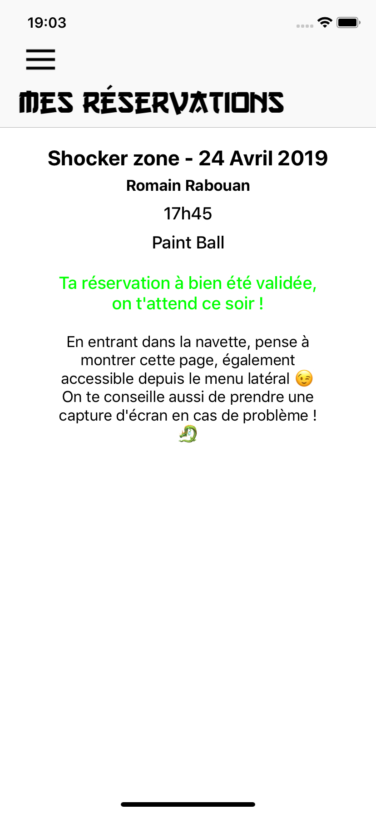

# ESEOKAMI iOS App 🐉

iOS App for ESEOKAMI, a students union running for the campaign that will take place in April. Click [here](https://github.com/romainrbn/eseokami_android) to see the Android version of this app.
 
**This app is still in development.**

## Features
- The user can see in real-time is current score. The user earns points by winning activities. To earn points, he needs to show is unique QRCode to the organizer. The organizer has his own version of the app. Instead of showing a QRCode, a scanner pops out. Then, he can add the points according to the activity. 

- The user has of course all the information about the union (members, day schedule, program, meals, videos, sponsors)\
 

-  The user can book his shuttle for a particular activity. The app automatically handles the number of reservations depending on the capacity of the shuttles. \
 

- Another major feature is a food delivery system. We have a list of 26 restaurants in Angers, France, in which users from the school can order for free. 4 teams deliver the orders. They instantly receive in the app their orders for their defined list of restaurants. Here they can set the order as delivered, impossible or carried. The user sees in real time is order status in the app, until his order has been delivered. \
   \
\
The organizer receives an order:  

- The app contains many animations created with [Lottie](https://github.com/airbnb/lottie-ios) : \
  

